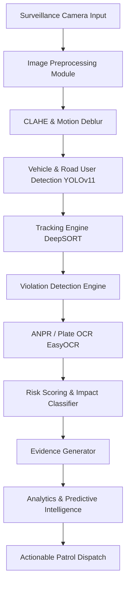

# Concept Note: TrafficEye AI
### Intelligent Traffic Violation Detection & Enforcement System

---

## 1. Executive Summary
Conventional traffic surveillance camera systems capture images and video feeds, but they lack the automated intelligence needed to process violations efficiently. Manual inspection of thousands of daily records creates significant bottlenecks, resulting in delayed enforcement and missed repeat offenders.

**TrafficEye AI** is an intelligent, edge-compatible computer vision platform that automates the detection, classification, plate extraction, and reporting of traffic infractions. Beyond passive monitoring, TrafficEye AI introduces three key innovations:
*   **Violation Risk & Impact Scoring**: Dynamically evaluates the hazard level of each offense using traffic density, location hazard index, and infraction type to prioritize enforcement alerts.
*   **Repeat Offender Profiling**: Correlates plate records in real-time to alert patrols when high-frequency violators are active.
*   **Predictive Traffic Intelligence**: Leverages historical violation records to forecast future hotspots and optimize patrol personnel deployment.

---

## 2. Problem Statement
The deployment of traffic surveillance cameras has resulted in massive volumes of photographic data. However, the current workflow suffers from the following:
1.  **Manual Labor Bottlenecks**: Reviewing thousands of images to verify red-light breaches or helmet compliance is resource-intensive and subjective.
2.  **Lack of Prioritization**: A vehicle parked illegally in an empty side street is treated with the same urgency as a motorbike triple-riding at speed through a busy intersection.
3.  **Reactive Policing**: Patrol officers are deployed based on arbitrary schedules rather than data-driven hotspot forecasts.

---

## 3. TrafficEye AI Solution Architecture

### 3.1 Functional Modules

#### 1. Image Preprocessing & Contrast Enhancement
*   **Low-Light Enhancement**: Applies Contrast Limited Adaptive Histogram Equalization (CLAHE) to boost details in dark night footage.
*   **De-weathering Filters**: Simulates and removes rain streaks and fog using bilateral filtering and dark channel prior dehazing algorithms.
*   **Motion Deblur**: Employs Richardson-Lucy deconvolution to correct cameras affected by high-speed vehicle vibrations.

#### 2. Vehicle and Road User Detection
*   **Model**: YOLOv11 nano/medium models optimized for rapid execution.
*   **Classes**: Motorcycle, Car, SUV, Bus, Truck, Auto-rickshaw, Pedestrian, Rider, and Passenger.
*   **Output**: Normalized bounding boxes, classification tags, and detection confidence values.

#### 3. Traffic Violation Detection Engine
*   **Helmet Non-Compliance**: Cross-references motorcycle riders with overlapping head-level bounding boxes. If no "helmet" class is detected, a violation is flagged.
*   **Seatbelt Non-Compliance**: Analyzes the windshield bounding box and maps a diagonal belt lane across the driver's torso.
*   **Triple Riding**: Group-counts bounding boxes intersecting a single motorcycle bounding box; flags if occupant count > 2.
*   **Wrong-Side Driving**: Compares optical flow vectors of vehicle bounding boxes against the predefined lane flow orientation.
*   **Stop-Line Violation**: Detects vehicle boundary overlapping the intersection stop line when the corresponding traffic light bounding box is in the "RED" state.

#### 4. Automatic Number Plate Recognition (ANPR)
*   **Localization**: YOLOv11 trained specifically on plate ratios.
*   **Transcription**: Uses EasyOCR or PaddleOCR text recognition models.
*   **Repeat Matcher**: Matches the recognized string against the active database ledger in real-time.

---

## 4. Key Innovation Modules

### 4.1 Violation Impact & Risk Score
Instead of treating all violations equally, the system computes a numerical **Risk Score ($R$)** between 0 and 100 for each event:

$$R = (S_v \times 0.5) + (D_t \times 0.3) + (L_s \times 0.2)$$

Where:
*   **$S_v$ (Severity of Violation)**: Categorical base weight (e.g., Red-light violation = 95, Seatbelt = 60, Illegal Parking = 40).
*   **$D_t$ (Traffic Density)**: Count of active vehicle bounding boxes in the frame at the time of violation (normalized 0 to 100).
*   **$L_s$ (Location Sensitivity)**: Pre-configured risk index of the intersection based on historical accident records.

High-risk events ($R \ge 75$) immediately escalate to the dispatch hub.

### 4.2 Repeat Offender Profiles
When an ANPR plate matches a registration with prior entries in the database, the system:
1.  Increments the offender citation count.
2.  Tags the active citation with a **Repeat Offender** status.
3.  Places the vehicle on a high-surveillance watch list.

### 4.3 Predictive Traffic Intelligence
By applying spatial-temporal clustering (DBSCAN) on historical violation entries, the system outputs:
*   **Hotspot Coordinates**: Intersections with high probabilities of violation.
*   **Peak Time Forecasting**: Time slots (e.g., rush hours) predicted to experience specific infractions.
*   **Enforcement Dispatch Recommendations**: Actionable guidance for deployment (e.g., *"Deploy 3 units to Sector-4 Crossroads between 18:00 - 20:00 to monitor helmet non-compliance"*).

---

## 5. Technology Stack & Implementation Details

| Component | Technology | Rationale |
| :--- | :--- | :--- |
| **Object Detection** | YOLOv11 | State-of-the-art inference speed and accuracy on small objects. |
| **Multi-Object Tracking** | DeepSORT | Stable ID mapping across occlusions. |
| **OCR Engine** | EasyOCR / PaddleOCR | Robust character extraction on skewed or dusty license plates. |
| **API Backend** | FastAPI (Python) | High-concurrency async framework suited for ML inference routing. |
| **Storage Engine** | PostgreSQL | Relational schema matching plate data with multiple citation tickets. |
| **Dashboard Interface** | React & Tailwind CSS | Premium responsive SPA frontend supporting SVG/Canvas visual rendering. |
| **Containerization** | Docker | Consistent deployment environment across cloud and edge servers. |

---

## 6. Project Roadmap & Expected Outcomes
1.  **Phase 1 (Months 1-2)**: Data annotation and fine-tuning of YOLOv11 for specific vehicle categories and violation bounding boxes.
2.  **Phase 2 (Months 3-4)**: Integration of tracking (DeepSORT) and plate OCR pipeline; development of the FastAPI backend.
3.  **Phase 3 (Month 5)**: Integration of the Risk Scoring algorithm, repeat offender matching database, and responsive React frontend.
4.  **Phase 4 (Month 6)**: Edge device calibration, system latency tuning, and final deployment.

### Expected Outcomes
*   **92%+ Reduction** in manual traffic image inspection hours.
*   **Real-Time Enforcement**: Citations generated and dispatched within 5 seconds of capturing the violation image.
*   **Targeted Policing**: Proactive officer deployments based on predictive hotspot forecasts, improving resource efficiency.
*   **Public Safety**: Measurable decrease in seatbelt and helmet violations within the first quarter of deployment.
